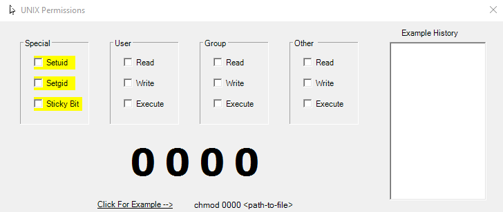

# Unix Permissions
### A WinForms programs which helps calculate Unix permissions commands

This was one of the first WinForms I created. There are obvious improvements to be made, not only should it be using WPF instead 😅 but the code behind could also be cleaned up a lot. I found my code very repetitive when first starting out. 

Here's a little gif of it in action:

 

### UPDATE
I created a more modern version of this using WPF and an MVVM model with Caliburn.Micro 😊 You can find it [here](https://github.com/IT-Delinquent/WPF_Unix_Permissions)
